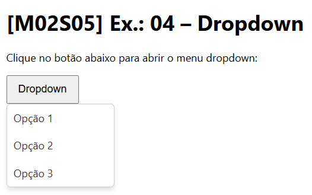

# [M02S05] Ex.: 04 – Dropdown

Exercício para praticar manipulação de eventos no DOM.

## Requisitos
- Criar um botão **"Dropdown"**.  
- Ao clicar, exibir o menu suspenso com opções.  
- Ao clicar fora do menu, ele deve desaparecer.  

## Como executar
1. Abra `index.html` em um navegador.  
2. Clique no botão **Dropdown** para abrir/fechar o menu.  
3. Clique em qualquer outra parte da página para fechá-lo.

## Resultado
